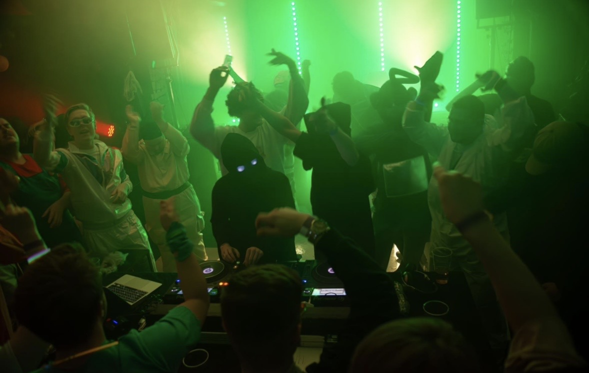

# Plassholdere

Alt som fortsatt er midlertidig på siden, og hva som skal til for å fjerne det.
Søk etter `PLASSHOLDER` i `index.html` for å finne dem i koden.

Status per 6. september 2026.

---

## 🔴 Blokkerer, bør fikses først

### Booking-e-post

**Hvor:** `index.html`, kontaktseksjonen, blokken `.booking__soon`
**Nå:** En boks med teksten «Booking email / Coming soon. DM on Instagram
in the meantime»

Adressen er ikke satt opp. Når den finnes:

1. Slett hele `<p class="booking__soon">`-blokken
2. Fjern kommentaren rundt `<a class="booking__mail">` rett over
3. Bytt ut `ADRESSE` begge steder, i `href="mailto:"` og i `data-scramble-hover`

Forslag: `booking@nvrmnd.no` hvis dere kjøper domenet, ellers en egen Gmail
som ikke er hans private.

### Pressebilde

**Hvor:** `index.html`, om-seksjonen, `<div class="about__img">`
**Nå:** Grå boks med teksten «PRESS PHOTO»

Trenger ett stående bilde, gjerne 3:4, mørkt og kontrastrikt så det matcher
resten. Legg det som `assets/press.jpg` og bytt ut div-en:

```html

```

---

## 🟡 Bør fikses, men siden fungerer

### Bio-teksten

**Hvor:** `index.html`, om-seksjonen, `.about__body`
**Nå:** Et utkast. Ikke skrevet av Marius selv

Teksten er faktisk riktig (Mo i Rana, leilighetsstudio, Need Me som debut),
men den er ikke hans stemme. Han bør lese den og gjøre den til sin. Holdt
bevisst anonym, navnet hans står ikke der.

### SoundCloud-brukernavnet

**Hvor:** `index.html`, to lenker, featured-seksjonen og sosiale medier
**Nå:** `soundcloud.com/marius-hagensen`

Navnet hans står i URL-en, selv om bioen er anonym. Marius skal døpe om
profilen til `soundcloud.com/nvrmnd`. Når det er gjort, oppdater begge lenkene,
inkludert direktelenken til remixen.

⚠️ Gamle SoundCloud-lenker slutter å virke når brukernavnet endres. Gjør det
før låtene deles bredt.

### TikTok

**Hvor:** `index.html`, sosiale medier, utkommentert lenke
**Nå:** Skjult

Profilen finnes ikke ennå. Når den gjør det: fjern kommentaren og sett inn URL.

---

## 🔵 Utenfor vår kontroll, distributøren må fikse

Disse lenkene ligger på siden fordi de tross alt fører til musikken, men de
peker til feil kontoer. Det er distributørens rot, ikke vårt.

### YouTube, feil kanal

**Lenke:** `youtube.com/watch?v=Cu71go7IyKI`
Need Me er publisert på en annen konto enn NVRMND sin. Riktig låt, feil eier.
Meld fra til distributøren og be om at den flyttes til riktig kanal.

### Amazon Music, feil artistprofil

**Lenke:** `music.amazon.com/artists/B01GB1HH3Y/nvrmnd`
Profilen blander inn utgivelser fra en annen artist som også heter NVRMND.
Amazon har eget skjema for å be om at artistprofiler slås fra hverandre.

**Sporlenken** (`music.amazon.com/tracks/B0HH3XDYPG`) er derimot riktig.

---

## ✅ Ekte innhold, ikke rør

Til orientering, så ingen tror dette er plassholdere:

| Element | Kilde |
|---|---|
| Coverbildet | Hentet fra Apple Musics katalog, 1400×1400 |
| Katalognummer NVR001 | Står på coveret |
| Utgivelsesdato 28. aug 2026 | Apple Music |
| Spilletid 2:24 | Apple Music |
| Spotify, Apple, Tidal, SoundCloud | Bekreftet riktige lenker |
| Instagram | `@nvrmnd.hardstyle` |
| Remixen | Random Nostalgia (NVRMND Remix), kun på SoundCloud |
| Mo i Rana | Bekreftet |

---

## Når alt er borte

Da kan denne fila slettes. Fjern også lenken til den fra `README.md`
og `PROSJEKT.md`.
